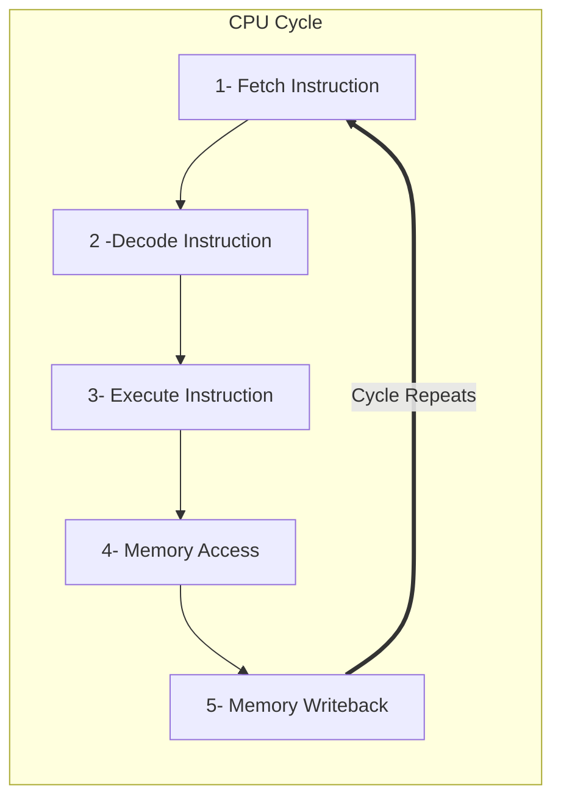

## Table of Contents
- [Table of Contents](#table-of-contents)
- [Foreword](#foreword)
- [How it all started](#how-it-all-started)
  - [The Ideation Pool](#the-ideation-pool)
  - [The Idea](#the-idea)
- [The Emulator](#the-emulator)
  - [The CPU](#the-cpu)
    - [Registers](#registers)
    - [A Cycle](#a-cycle)
- [Where Are We Now?](#where-are-we-now)
- [Sources](#sources)

## Foreword

As of the time of writing this post I'm listening to Diana Ross which always sets me in a great mood for working or just focusing. Such amazing vibes. Go and give it a listen if you have some spare time on your hands :wink:

<iframe style="border-radius:12px" src="https://open.spotify.com/embed/album/7jqe6yQ9qtHqahli8WSYH4?utm_source=generator" width="70%" height="152" frameBorder="0" allowfullscreen="" allow="autoplay; clipboard-write; encrypted-media; fullscreen; picture-in-picture" loading="lazy"></iframe>

Let's talk about the real stuff shall we ?

## How it all started

Since I started studying at EPITECH, I knew every student will have to present an ***end-of-study*** project. So I for sure knew that I had to think of a project that I would be working on for almost 2 complete years (from 2024 to 2026). Also every project must be done in teams ranging from 3 to 6 people and depending on the "***track***" we chose, the group size would vary quite a bit.

I decided to go for the ***technical track*** as I wanted to explore the more low-level aspect of programming and finally develop software from scratch. After deciding which track I would follow, I got together with 2 friends of mine to form a team. At that time we didn't have any concrete ideas for a project yet. Enter the ***EIP Ideation Pool***

### The Ideation Pool

During the ideation pool, we were supposed to find and then present the ideas we found, and *in-fine* decide of our final project's idea and lock it in with the school. To be honest the ideation pool was not easy, we had a pretty hard time finding a project that would be interesting, fun, require enough work for 3 developers for 2 years, and that the final jury would like. As you can see there are a lot of parameters that we had to factor in. We didn't want to undertake a project that was not stimulating or fun but that would be approved by the jury, and on the other hand we had to find an idea the jury would like. We went through many iterations of multiple ideas that will never see the light of day and finally after several weeks of brainstorming, researching and lots of coffee breaks, we had it. We were going to create our own Playstation 1 emulator from scratch in C++.

### The Idea

If you are here reading this post, you certainly know what's a console emulator. ***However*** if you're asking "what the f*** is a console emulator" then two things:
1. How did you end up reading a dumb software developer's blog
2. Don't worry I will explain to you briefly what's an [emulator](https://en.wikipedia.org/wiki/Emulator) and how it works. Don't hesitate to look it up on google too you will surely find a lot more information

According to wikipedia:
>In computing, an emulator is hardware or software that enables one computer system (called the host) to behave like another computer system (called the guest). An emulator typically enables the host system to run software or use peripheral devices designed for the guest system. Emulation refers to the ability of a computer program in an electronic device to emulate (or imitate) another program or device.
>
> -- <cite>[Wikipedia](https://en.wikipedia.org/wiki/Emulator)</cite>

This means a Playstation 1 emulator piece of software would have to exactly reproduce the behavior of the original Playstation. Wooow that seems pretty hard right? It's because it is (trust me sometimes I wish I prepared myself better). In any case, the emulator has to execute the game code as close to the hardware it's trying to emulate (or as close as possible).

> It is **very**, **very** hard and sometimes not preferable/impossible to implement an emulator behaving 100% the same as the original hardware.
>
> This is due ot many factors and mainly due to console being closed source, so anything that is not openly documented has to be reverse engineered.
> It takes a lot of time and effort and can't always be 100% accurate.
{: .prompt-info}

Now everybody knows what's an emulator yahoooo!

Many emulators for the Playstation 1 exist and each have their own distinct features and advantages but we wanted to have a little more than what's already available. We wanted players to be able to synchronize their game saves, progress, as well as to be able to play "*online*" with their friends. I say "*online*" because the PS1 which was released almost 30 years ago (1994) didn't have online games. So the online part of the emulator would be responsible of connecting players to a "*common*" console so they would play on the same console to the same game. It's easier said than done I know but we aren't there yet.

Anyways to begin implementing an emulator we need:
- First, have a certain knowledge about low-level programming and electronics
- Second, be able to read enormous amounts of community documentation, manufacturers technical documentation, and very old blogs about reverse engineering.
- And finally third, patience, lots of patience and perseverance.

Now for the third predicate, it's only up to you to decide if you are capable of being this patient and often make mistakes. I'm not saying it's easy to be patient but unfortunately it's necessary. So suit up and let's begin the adventure.

## The Emulator

{: .shadow}
_Architecture Diagram of the Playstation 1 Hardware[^ps1-architecture-diagram]_

As you can see there are many hardware components inside the console, which are talking ot each other via the main bus (green line) and sub-buses (black and red lines)

For now let's just focus on the implementation of the CPU which is the "***brain***" of the console. It's the CPU that will make all the crucial calculations needed for the game to run.

### The CPU

The CPU that is in the Playstation 1 is the [^mips]MIPS [R3000](https://en.wikipedia.org/wiki/R3000). It's a 32bit RISC processor which has a simplified instruction set and only a single addressing mode is supported (`base + displacement`or `base + offset`). It can also be connected to up to 4 co-processors, thus delegating some of the calculations to other components.

#### Registers
There are 3 different instruction types:

<table align="center">
  <thead>
    <tr>
      <th>Type</th>
      <th colspan="6">Format</th>
    </tr>
  </thead>
<tbody>
  <tr>
    <td>Register (R)</td>
    <td rowspan="3">opcode (<em>6 bits</em>)</td>
    <td rowspan="2">rs (<em>5 bits</em>)</td>
    <td rowspan="2">rt (<em>5 bits</em>)</td>
    <td>rd (<em>5 bits</em>)</td>
    <td>shamt (<em>5 bits</em>)</td>
    <td>func (<em>6 bits</em>)</td>
  </tr>
  <tr>
    <td>Immediate (I)</td>
    <td colspan="3" align="center">immediate value (<em>16 bits</em>)</td>
  </tr>
  <tr>
    <td>Jump (J)</td>
    <td colspan="5" align="center">immediate address (<em>26 bits</em>)</td>
  </tr>
</tbody>
</table>

opcode
: The instruction "*number*" which tells the CPU which instruction to execute.

rs
: The *source* register. It tells the CPU to take whats in the *rs* register and use it as a parameter of the calculation.

rt
: The *target* register. It is also used a a parameter for an operation. Depending on the instruction type it can be used as a parameter by taking the value contained by *rt* or used to store the result of an operation (during a *load* operation for example).

rd
: The *destination* register.

shamt
: Shift amount to apply to to the operation in ***register*** mode.

func
: The function (instruction) to execute. When the instruction *opcode* is `0x00` the *func* parameter is used to determine the instruction to execute.

immediate value
: The immediate value is used as an operand of the operation. It's a 16-bit signed and sign extended value.

immediate address
: The 26 bit immediate address to jump to. The final address is computed by shifting this value 2 places to the left and ANDing it with the opcodes 4 MSB (Most Significant Bits). It results in a 28 bit address.

The MIPS R3000 also has 32 32-bit General Purpose Registers (GPR) and 3 special registers:
- The Program Counter register (pc)
- The HI register
- The LO register

The HI and LO registers are used to store the results of a multiplication/division operation

| Index   | Name        | Purpose                          |   Preserved Across Calls   |
| :------ | :---------- | :------------------------------- | :------------------------: |
| $0      | $zero or $0 | Always zero                      |      ✔ Hardwired to 0      |
| $1      | $at         | Reserved for assembler           |             ✘              |
| $2-$3   | $v0-$v1     | 1st and 2nd return values        |             ✘              |
| $4-$7   | $a0-$a3     | First four arguments of function |             ✘              |
| $8-$15  | $t0-$t7     | Temporary Registers              |      ✘ (Obviously...)      |
| $16-$23 | $s0-$s7     | Saved Registers                  | ✔ (Again it's in the Name) |
| $26-$27 | $k0-$k1     | Reserved for kernel (OS)         |             ✘              |
| $28     | $gp         | Pointer to global data already   |             ✔              |
| $29     | $sp         | Stack pointer                    |             ✔              |
| $30     | $fp         | Frame pointer                    |             ✔              |
| $31     | $ra         | Return address                   |             ✔              |

#### A Cycle

It's a simplified version of a cycle which in reality is a little more complex. Just to illustrate what I mean by that here's the diagram showing everything that's happening under the hood.

.png){: .shadow}
_Detailed CPU Cycle Diagram_

I give it to you. It's not easy to understand, and quite frankly you don't need to know this much to start implementing your CPU but it's always nice to try and understand how the designers of this chip were thinking and solving the problems they had at the time.

One of the specificities of this CPU is its 5-stage instruction pipeline. It allows it to execute close to 1 instruction per cycle which was a huge advantage at this time. By pipelining instructions, the CPU would execute the current instruction and fetch the next instruction at the same time (and more with memory accesses and writes). This has great performance advantages but comes with some drawbacks when programming. Some delays have to be inserted after branches or memory accesses AKA *loads* (only on MIPS I, since MIPS 2 only branch delays are required) so the programmer has to be careful.

## Where Are We Now?

We have seen a lot of information about the CPU, and trust me it's just the tip of the iceberg. There are many, many more features and functionalities within the CPU (notably the coprocessor, memory mapping, cache, etc.) we still need to see. but for now I think you get the global idea about what it takes to code a Playstation 1 emulator from scratch. It takes a lot of dedication to read and understand the documentation, but in the end you learn so much new stuff and have fun that it is worth the effort.

I will explain in greater detail how the CPU works and what missing part we have not yet really talked about (👋 coprocessors) in the next article. We will have a look at the other components of the console in further posts and then seeing how they interconnect with each other (via the bus).

I hope you liked reading this article and I hope you learned a thing or two!

> If you have any suggestion, question or you just you want to show your enthusiasm don't hesitate to leave a comment down below
{: .prompt-tip}

## Sources
[^ps1-architecture-diagram]: An amazing and detailed article about the Playstation 1 written by R. Copetti [:link:](https://www.copetti.org/writings/consoles/playstation/).

[^mips]: The MIPS architecture Wikipedia article [:link:](https://en.wikipedia.org/wiki/MIPS_architecture)

*[CPU]: Central Processing Unit
*[RISC]: Reduced Instruction Set Computer

